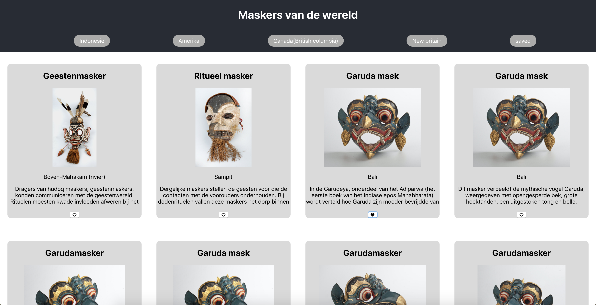

# Maskers van de Wereld

Dit is een React web-app die maskers uit verschillende delen van de wereld laat zien uit de collectie van het Nationaal Museum van Wereldculturen.



## Concept
Over tijd hebben verschillende plaatsen en verschillende culturen maskers een rol gespeeld.
Doormiddel van deze app krijg je een kijkje van de maskers die in de collectie zitten uit verschillende gebieden rond de wereld.

## Features
- sparql als databron
- overzicht van maskers per gebied uit de collectie
- een collectie van favoriete maskers samenstellen
- collectie wordt lokaal opgeslagen

## to-do
- [X] Data opvragen via de NMVW databank
- [X] Collectie weergeven
- [X] Collectie filteren op basis van locatie
- [X] Opslaan/verwijderen van favorieten
- [X] state change interacties tussen components
- [ ] User feedback


## Installation
Dit project is gebouwd met create-react-app en sparql
Clone de repo:
```bash
$ git clone https://github.com/dorusth/frontend-applications.git
```
start de app met:
```bash
$ cd frontend-applications
$ npm install
$ npm run start
```
En ga naar "http://localhost:3000/"


[MIT](LICENCE) © [Dorus ten Haaf](https://dorustenhaaf.com)
